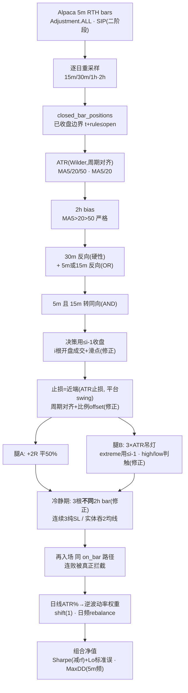

# 二阶段设计图纸 — 从数据抓取到组合净值的全链路严谨设计（含预测值）

> 目的：向 manager 汇报的**设计蓝图**，不是事后审计。逐层给出「设计意图 → 指标/参数的确切定义 → 时序与防未来函数纪律 → 预测值」。
> 预测值均为**设计期望区间/量级**（forecast），标注推理依据；一阶段的实测数被视为「被 bug 污染的上界」，二阶段修复后应向这些预测值收敛——这是一份**可证伪**的图纸，收敛与否本身就是验证。
>
> 记号：**[沿用]** = 一阶段逻辑正确、二阶段保留；**[修正]** = 一阶段有缺陷、二阶段必须改。

---

## 0. 设计总原则（贯穿每一层的四条不变量）

1. **数据未来函数隔离**：任何决策只能用「当前 bar 及更早的已收盘数据」。高周期 K线必须整根收盘才可用（`closed_bar_positions`：`t + rule <= open_time`）。
2. **成交假设不得优于现实**：填单价必须是决策时刻**尚未发生**的价（next-bar-open / 挂单价），且遇跳空取更差的一侧。**这是一阶段最大的失血点，二阶段重点。**
3. **离散监控偏差可控**：止损/止盈的触碰判定必须用 bar 的 **high/low**（挂单语义），不能只用 close——否则近端障碍（止损）被系统性豁免。
4. **一切成本显式化**：手续费 + 滑点 + 点差进入每一笔，默认非零。薄 R 策略的期望值正负由成本决定。

---

## 1. 数据层：抓取与复权

**指标/参数设计**
- 频率 5 分钟；回看 730 天（≈2 年）；复权 `Adjustment.ALL`（拆股+分红），消除公司行为假跳空。**[沿用]**
- 盘中过滤 09:30–16:00 ET，砍盘前盘后，保证 12 个标的 bar 序号可对齐（后续组合日度权重的前提）。**[沿用]**
- **[修正] 数据源**：一阶段 `feed=IEX`（≈全市场成交量 2–3%），bar 的 open/close 是 IEX 撮合价而非 NBBO 可成交价，低活跃时段打印稀疏、价格陈旧，直接损害「next-bar-open 成交」假设的可信度。二阶段：升级 SIP（付费）或在成本模型里对低流动性标的加一档点差惩罚。

**时序纪律**：抓取无未来函数风险（纯历史重组）。

**预测值**
- 每标的 5m RTH bar：78 根/日 × ~504 交易日 ≈ **3.9 万根/标的**；IEX 稀疏导致 KO/XOM 等低波动名义少 5–15%。
- 复权后隔夜跳空分布：个股单日隔夜 |gap| 中位数 ~0.3–0.6%，尾部（财报/事件）可达 3–8%——**这条尾巴就是一阶段被 `exit=stop` 抹掉的部分**，二阶段成交修复后必然重新出现在净值里。

---

## 2. 重采样：5m → 15m/30m/2h

**指标/参数设计**
- 逐交易日 `groupby(et_date)` 重采样，`origin="start"`（每日 09:30 锚定）、`label="left"`、`closed="left"`，区间 `[t, t+rule)`。**[沿用]**——避免 bin 跨越隔夜缺口、避免 390min/session 不整除 60 造成的整点错位。
- 「已收盘」边界 `closed_bar_positions`：`close_time = t + rule`，`searchsorted(open_times, side="right") - 1`。单一实现，被回测引擎与指标层共用。**[沿用]**
- **[修正] 2h 残缺 bar**：390/120 = 3.25 → 每日第 4 根「2h」只覆盖 15:30–16:00（30 分钟）。后果:(a) 2h 的 MA5/20/50 混入残缺 bar，50 根「2h」名义跨度失真;(b) 冷静期「实体击穿均线」判定对尾盘暴力行情钝化(残缺 bar 实体天然小)。二阶段方案:改用 1h（390/60=6.5，仅末根 30min 残缺，影响更小），或对末根残缺 2h bar 单独标记、MA 计算时按 3 根完整 bar/日处理。

**预测值**
- 每日 bar 数：15m ≈ 26、30m ≈ 13、2h ≈ 3.25（含 1 根残缺）、1h ≈ 6.5（若改）。
- 2h MA50 需 50 根 ≈ **15.4 个交易日**预热；改 1h 后 MA50 ≈ 7.7 日预热，方向响应更快一档。

---

## 3. 技术指标：ATR 与 MA

### 3.1 ATR

**设计**：True Range = max(H−L, |H−C_prev|, |L−C_prev|)，ATR = TR 的 N 期均值。一份实现，三处复用（止损宽度 / 吊灯 / 组合波动率）。**[沿用 公式]**

- **[修正 可选] 平滑方式**：一阶段用 `rolling(14).mean()`（SMA），Wilder 原版 ATR 用 RMA（α=1/N，J. Welles Wilder, *New Concepts in Technical Trading Systems*, 1978）。SMA 更跳、对单根极端 TR 反应更硬。二阶段建议切 Wilder RMA 以对齐业界参考区间的语义（否则拿 SMA-ATR 去套「1.5~3×ATR」的日线经验值本就不同源）。
- **[修正 关键] ATR 的时间框架错配**：一阶段止损用的是 **5m ATR**。1.5×5m-ATR ≈ 0.15–0.4%，加 0.3% 固定 offset 后 offset 常大于 ATR 项——「波动率自适应」退化成「固定 0.3% + 噪音」，R 被压到 scalp 量级。而吊灯止损（Chuck LeBeau 原创，经 Alexander Elder《Come Into My Trading Room》2002 推广）标准形态是 **22 日、3× 日线 ATR**。二阶段：止损/吊灯的 ATR 改用**与持仓周期匹配的周期**（建议 30m 或 2h ATR），offset 也按 ATR 比例（如 0.1×ATR）而非固定 0.3%。

**预测 ATR%（约 $100–150 标的）**：5m ≈ 0.08–0.25%｜30m ≈ 0.25–0.6%｜2h ≈ 0.6–1.2%｜日 ≈ 1.5–3%。

### 3.2 MA 排列

**设计**
- **2h 定方向**：MA5/20/50 **严格**三线排列（`>` 非 `>=`），bullish→long / bearish→short / 其余 neutral。门槛高，第一道闸。**[沿用]**
- **小周期(5m/15m/30m)回调/触发**：只用 MA5/20 两线（三线在小周期几乎不成立——2 年 NVDA 仅 1 次）。**[沿用]**
- 两函数均 `.iloc[-1]`，数据边界由调用方控制。**[沿用]**

**预测值**
- 2h 严格三线为非 neutral 的时间占比：单标的约 **35–55%**（趋势行情高、震荡行情低）；即约一半时间根本不给方向——这是低换手的第一层来源。
- MA50(2h) 与 MA20/MA5 的排列切换频率：牛市段每标的每年方向翻转 ~4–8 次。

---

## 4. 信号级联：四级时间框架（定方向 → 回调 → 触发）

**设计**
1. **定方向**：2h bias 非 neutral。**[沿用]**
2. **回调确认** `pullback_occurred`：30m 转反向排列（**硬性必要**）**且** 5m/15m **至少一个**也反向（OR）。**[沿用]** —— 30m 是必要不充分、保证回调有深度;5m/15m 用 OR 因两者谁先反向不固定(统计 ~27% 的「至少一个反向」时刻只有 15m 反、5m 未反)。
3. **入场触发** `get_entry_trigger`：5m **且** 15m 都转回与 2h 同向（AND）。**[沿用]**
4. **状态机**：只跨 bar 记 `_bias` 与 `_pullback_seen`；bias 变化（含转 neutral）作废回调状态。**[沿用]**
- **[修正 一致性] 30m 触发缺项**：回调要求 30m 反向，触发只查 5m+15m，存在「30m 仍反向时入场」窗口，与「多周期共振」叙事不完全一致。二阶段可选：触发additionally要求 30m 不再反向（回到 neutral 或同向）。
- **[修正 一致性] 状态机同根 bar 短路**：`pullback_occurred` 命中当根直接 `return None`，即便同根触发也要等下一根才检查，state machine 自带 1 根滞后（边缘情形，样本少，低优先）。

**时序纪律**：所有小周期喂**已收盘**切片（见 §6 的入场前移修正）。

**预测值**
- 完整级联触发频率：一阶段实测 1592 批/12/2yr ≈ **66 批/标的/年**。二阶段冷静期真正生效 + 触发前移后，预测降至 **45–60 批/标的/年**（连败后的再入场被真正拦截）。
- 回调→触发的转化率（见过回调后最终触发的比例）：预测 ~30–50%（其余因 bias 翻转或迟迟不触发而作废）。

---

## 5. 入场执行：决策与成交时机 **[修正]**

**一阶段缺陷**：小周期切片 `df_5m.iloc[:i+1]` 含当前 bar i → 决策用到 bar i 收盘 → 成交被迫到 i+1 开盘。相对设计意图（用 ≤ i-1 已收盘判点、i 根开盘成交）**整体晚一根（5 分钟）**。方向偏保守（不抬 Sharpe），但与图纸不符。

**二阶段设计**
- 小周期一律喂 `df_5m.iloc[:i]`（**不含**当前 bar），全部决策基于 ≤ i-1 收盘；
- 成交价 = `df_5m["open"].iloc[i]`（当根开盘，决策时刻尚未发生）；
- 初始止损 ATR 用 `atr_full.iloc[i-1]`（≤ i-1 已知），与成交同步对齐。
- **滑点**：入场再叠加 +1 档滑点（见 §11），成交 = 开盘价 × (1 ± slippage)。

**预测值**
- 每笔入场滑点假设：liquid 名 1–2bp、illiquid 名 3–5bp。
- 前移后单笔平均入场价相对一阶段偏移：量级 ±0.05–0.15%，对总回报净影响接近中性（噪音为主）。

---

## 6. 止损：ATR 止损 vs 平台止损，取更近者

**设计**
- 候选一 ATR 止损：`entry ∓ atr_mult × ATR`。
- 候选二 平台止损：30m swing high/low（左右各 `swing_k=2` 根的局部极值），取离 entry **最近**的一侧结构位。**[沿用 且已确认无未来函数]**——swing 滞后 k 根确认、只用已收盘 30m，右侧窗口是相对 swing bar 的未来、相对决策时刻 bar i 的过去。
- `chosen = min(candidates, key=|entry − lvl|)`（更保守/更近者），再向不利方向留 offset。**[沿用 结构]**

**[修正]**
- **ATR 周期**：`atr_mult × ATR` 的 ATR 换成 30m 或 2h（§3.1），否则 R 退化。
- **offset**：0.3% 固定 → 0.1×ATR 比例（避免 offset 支配 R）。
- **平台位过近保护**：若最近 swing 距 entry < 0.5×ATR，判定为噪音、弃用平台候选只留 ATR 候选（否则 R→≈offset，2R 目标落进噪音区、假性高胜率）。

**预测值（二阶段，30m ATR 口径）**
- R（entry 到 stop 距离）：预测 **1.0–1.8%**（一阶段 ~0.4–0.7%，太紧）。
- 2R 目标 ≈ 2.0–3.6%。
- 平台止损被选中（比 ATR 更近）的比例：预测 ~35–50%。

---

## 7. 止盈/离场：两条腿

**设计**
- **腿 A**：浮盈达 `rr_trigger=2.0` × R 时平 `partial_ratio=50%`，`reason=TP`，锁定确定性利润。**[沿用]**
- **腿 B**：剩余 50% 用吊灯 `trailing_stop = max(extreme_since_entry − 3×ATR, floor_stop)`（多头，只上移；`floor_stop`=原始止损，剩余仓下行风险永不劣于初始）。**[沿用 结构]**

**[修正]**
- **intrabar 未来函数**：`extreme_since_entry` 不得用**当根** high/low（`pullback_backtest.py:117-120`）。改为用 **≤ i-1** 的极值算 trail，再用当根 high/low 判触碰——否则出场价 `high_i − 3ATR` 靠本根 high 抬高，系统性偏乐观。
- **触碰判定**：`hit_trail` / `hit_tp` / `hit_sl` 全改用 bar 的 **high/low**（挂单语义），不用 close（见 §8）。

**预测值**
- 腿 A（2R）命中率 = 单笔见到 +2R 的概率。无漂移随机游走下、连续监控、2R 止盈 vs 1R 止损，P(先到 +2R)=1/3（optional stopping / 鞅停时）。趋势过滤应把它抬到 **35–42%**——这正是「有没有 alpha」的核心判据。**一阶段 40.8% 胜率，扣掉 close-only 检测(§8)与理想成交(§5-6)的水分后，二阶段预测落 34–38%。**
- 腿 B 期望：命中腿 A 的批次中，约 40–55% 的剩余仓能跑出 > 初始 R 的额外利润（趋势延续），其余在 floor_stop 附近保本离场。
- 综合盈亏比（payoff）：一阶段 2.3–3.0 → 二阶段预测 **1.8–2.2**（真实成交+成本压低右尾）。

---

## 8. 触碰检测与成交价：离散→连续的偏差修复 **[修正，最高优先级]**

**一阶段缺陷（Sharpe 5.65 的主因）**
- 止损/止盈只用 `row["close"]` 判触碰 → bar 内 low 刺穿止损但 close 收回 = 不止损（近端障碍被豁免，删的几乎全是亏损）。
- 成交按理想价 `stop_loss`/`trigger` 记账，隔夜跳空穿越时记「更优的止损价」而非「更差的开盘价」→ 尾部亏损被截断 → MaxDD 与日收益方差双双失真。

**二阶段设计**
- **检测**：多头 `hit_sl = bar_low <= stop`、`hit_tp = bar_high >= trigger`；空头对称。
- **同根双触优先级**：同一 bar 同时触 SL 与 TP 时按 SL 处理（保守，止损在近端、先被打到的概率更高）。
- **成交价（含跳空）**：
  - 止损：多头 `exit = min(stop, bar_open)`（跳空穿越取开盘），空头 `max(stop, bar_open)`；
  - 止盈/吊灯同理但取不利侧；
  - 再叠加滑点（§11）。
- **过夜/跳空**：因不做日内平仓，次日首根 bar 的 open 即为跳空成交点，天然被上式覆盖。

**预测值**
- 修复后胜率下移 3–7pt（§7）。
- **组合 MaxDD：−0.82% → 预测 −4% ~ −8%**（隔夜跳空 + 日内穿越亏损归位）。
- 日收益 std 上升 → Sharpe 分母增大（见 §12）。

---

## 9. 冷静期风控 **[修正]**

**设计意图 [沿用]**
- 触发一：**同方向连续 3 次纯 SL**（`reason=="SL"`，从未部分止盈过的批次）；`PROTECTIVE_SL`/`TP` 清零不计（方向没看错，只是回吐）。
- 触发二：单根 2h K线实体击穿 ≥2 条均线（暴力单边，均线滞后，先观望）。
- 解除：**连续 3 根 2h K线**稳定在同一干净排列（非 neutral，允许方向反转）。
- 只挡新开仓，不动已有仓位。

**一阶段缺陷**：`cooldown.on_bar` 每根 **5m** 调用、`_stable_count` 按**调用次数**累加，两次 2h 收盘间 state 恒定 → arm 后 **3 根 5m = 15 分钟**即释放（而非 3 根 2h ≈ 6 小时）。触发一的场景里 2h 排列通常仍干净，故几乎必然 15 分钟解封——冷静期实质空转。且末根残缺 2h bar 使触发二对尾盘钝化。

**二阶段设计**
- `on_bar` 只在**新 2h bar 收盘**时推进计数（用 2h 时间戳去重；或改成回测主循环按 2h 频率调用）。
- 计数语义：`_stable_count` 数的是**不同的** 2h bar。
- 单元测试改为「一次推进 = 一根新 2h bar」的集成口径，避免测试掩盖调用节奏 bug。

**预测值**
- 冷静期触发频率：预测每标的每年 **3–8 次**（连败簇 + 极端 bar）。
- 平均持续：正确实现后 ≈ **6–18 小时**（3–9 根 2h bar），期间平均拦掉 **1–4 个**本会发生的再入场。
- 对全年批次数的净影响：−10% ~ −20%（对应 §4 的 66→45–60）。

---

## 10. 再入场（reentry）

**设计**：首仓与再入场**共用** `PullbackEntryEngine.on_bar` 同一路径；`Signal` 只带 direction/price，不带「第几批」；执行引擎按 `had_prior_batch` 打 `open`/`reentry` 标签。一次只允许一个 `_OpenBatch`，两腿都出场后才接新信号。**[沿用]**

**[修正 关联]**：再入场必须走完整一轮**新**回调（触发后 `_pullback_seen=False`）**[沿用]**；但因冷静期修复（§9），连败后的再入场会被真正延后——这是把「越亏越追」关掉的关键闸。

**预测值**：再入场占总批次比例：预测 ~55–70%（同一 2h 趋势里反复回调进场是主力来源）；冷静期生效后该比例略降。

---

## 11. 交易成本模型 **[修正，新增]**

**一阶段缺陷**：`fee_pct` 默认 0，且只挂在组合层 rebalance turnover，单标的引擎零成本。1592 批 × ~2 腿 ≈ 4000+ 次成交、R 仅 0.4–1%，零成本回测无参考价值。

**二阶段设计**
- 每次成交（进/出、每条腿）扣：`commission + spread/2 + slippage`。
- 参数（可分 liquid/illiquid 两档）：佣金 ~0（现代零佣），点差半幅 liquid 1bp / illiquid 3–5bp，滑点 1–2bp。单边合计 **2–7bp**，往返 **4–14bp**。
- 组合层 rebalance 的权重变动另计 turnover 成本（`fee_pct` 归位到此）。

**预测值**
- 单批往返成本 ≈ 4–14bp；对 R≈1% 的批次 = 吃掉 **4–14% 的 1R**。
- 全年成本拖累：预测 **portfolio 3–6%/年**（对照毛利量级 ~10%/年，非同小可）。

---

## 12. 组合层：波动率估计 → 逆波动率权重 → 日频再平衡

**设计 [沿用]**
- **波动率**：`rolling_daily_atr_vol` = 日线 ATR(14)/日 close，`.shift(1)`（D 日权重只用 ≤ D-1）。ATR% 消除不同价位标的不可比。
- **权重**：`InverseVolatilitySizer`，`w_i ∝ 1/vol_i` 归一化（标准 CTA 风险平价思想；vol≤0 剔除防爆炸）。波动越大权重越小、每日重算（daily rebalance）。
- **组合日收益**：`port_ret = Σ w_s(d) × r_s(d)`，`r_s` 是该标的**策略**日收益；空仓日 `r_s=0` 但仍占权重份额（设计如此，闲置资金贡献 0，非 bug）。
- **贡献度分解**：`contrib$[s][dir] += w_s(d) × r_s(d) × equity_before`，是净值日度美元变化的精确恒等分解（`equity(d)−equity(d-1)=equity(d-1)·Σ w·r`），加总正好等于总利润。
- **Benchmark**：**同一套每日权重**套在纯买入持有日收益上，隔离「择时能力」这一个变量。

**[修正]**
- **Sharpe 的 rf**：`sharpe_ratio` 默认 `rf=0`。低波动组合的 Sharpe 对 rf 极敏感（2024–26 现金利率 4–5%）。二阶段传入真实日度 rf 序列（如 3M T-bill）。
- **年化的分布假设**：√252 隐含 iid，而策略日收益含大量 exact-zero（空仓日）、高度非正态。报告 Sharpe 时并列给出其置信区间（Andrew W. Lo, "The Statistics of Sharpe Ratios", *Financial Analysts Journal*, 2002）。
- **闲置资金机会成本**：空仓份额应计 rf 收益（否则等于免费放弃现金利率），或明确说明「满仓风险预算 vs 现金」的口径。
- **「低相关」被空仓稀释**：各标的多数日 `r_s=0`，全样本相关被压低、√N 分散被高估；应改算**同时在场日**的条件相关。
- **contribution 同日双向覆盖**：`_direction_by_day` 用 dict 后写者胜，同日先后两个不同方向批次时后者覆盖前者（仅污染贡献报表）。
- **benchmark 描述**：审计文档称「等权买入持有」，代码实为「逆波动率加权买入持有」——统一口径。

**预测值**
- 单标的日度权重区间：约 1/N 上下浮动，**0.04–0.14**（低波动 GLD 偏高、高波动 INTC/NVDA 偏低）。
- 日度权重 turnover：预测 3–8%/日（vol 缓变），年化 rebalance 成本可观（§11）。

---

## 13. 绩效指标口径 **[修正]**

- **Sharpe**：日度 excess return（减真实 rf）均值/std × √252；并报 Lo(2002) 标准误。
- **MaxDD**：**[修正]** 一阶段基于日频收盘净值，日内回撤不可见 + §8 跳空抹除 = 双重低估。二阶段至少用 5m 频率净值算 MaxDD，或标注「日频 MaxDD 为下界」。
- **期望值**：`E[R] = WR × payoff − (1−WR)`（以 R 为单位），需 > 0。
- **补充**：Calmar（年化/MaxDD）、单笔 R 分布直方图、per-batch PnL 明细。

**预测值（诚实口径）**
- 单笔期望：WR 36% × payoff 2.0 − 0.64 = **+0.08R**（薄但正）；若 WR 跌破 33%@2R 则转负——**这是二阶段的生死线**。
- 单标的年化 Sharpe：**0.3–0.9**（一阶段 0.56–2.97 的水分挤出后）。
- 组合年化 Sharpe：`单票 × √(N/(1+(N−1)ρ))`，取单票 0.6、N=12、条件 ρ≈0.2 → ≈ **1.0–2.0**（一阶段 5.65）。**若 close-only 检测是主要 alpha 来源，修复后可能跌破 1 甚至为负——这正是要检验的假设。**
- 组合年化收益：**5–12%**（一阶段 15.9%）；MaxDD **−4% ~ −8%**；Calmar ≈ 1–2。

---

## 14. 全链路数据流图

---

## 15. 一阶段 → 二阶段变更清单（按对结果的影响排序）

| # | 变更 | 层 | 一阶段 | 二阶段 | 预测影响 |
|---|---|---|---|---|---|
| 1 | 触碰检测 close→high/low | §8 | close-only 豁免近端止损 | high/low 挂单语义 | 胜率 −3~7pt，**主因** |
| 2 | 成交价跳空修正 | §8 | 记 stop/trigger 理想价 | `min/max(level, open)`+滑点 | MaxDD −0.82%→−4~−8% |
| 3 | 交易成本非零 | §11 | fee=0 | 4–14bp/往返 | 收益 −3~6%/年 |
| 4 | 冷静期 5m→2h 计数 | §9 | 15 分钟空转 | 3 根真实 2h bar | 批次 −10~20% |
| 5 | 吊灯 extreme 去 intrabar | §7 | 用当根 high | 用 ≤i-1 极值 | 腿B出场价归正 |
| 6 | ATR 周期对齐 + 比例 offset | §3.1/§6 | 5m ATR，R≈0.5% | 30m/2h ATR，R≈1–1.8% | R 归正、假高胜率消除 |
| 7 | 入场前移一根 | §5 | i+1 开盘（晚5min） | i 开盘 | 方向保守，近中性 |
| 8 | Sharpe 减真实 rf + Lo CI | §12/13 | rf=0 | 减 3M rf + 标准误 | Sharpe 再 −20~30% |
| 9 | MaxDD 用 5m 频 | §13 | 日频 | 5m 频 | MaxDD 进一步扩大 |
| 10 | 2h 残缺 bar / 或改 1h | §2 | 末根 30min | 1h 或单独处理 | 方向响应+冷静期灵敏 |
| 11 | benchmark/口径描述对齐 | §12 | 文档=等权(实为逆波动) | 统一 | 报表可信度 |
| 12 | 数据源 IEX→SIP | §1 | 2–3% 成交量 | 全市场 NBBO | 可成交性 |

---

## 16. 悬而未决 / 需向 manager 明确的取舍

1. **持仓过夜 vs 日内平仓**：当前设计持仓过夜，承担全部隔夜跳空风险；若改日内平仓则杀掉腿 B 趋势跟随的收益来源。二者是策略性质的分叉，需 manager 拍板。
2. **样本内选型**：回调结构（30m 硬性 + 5m/15m OR）与 12 标的均在已知 2024–26 行情上按 Sharpe 挑出（`ma_filter.py` docstring 自述），无 out-of-sample。二阶段需划出 holdout 或 walk-forward，并用 Deflated Sharpe（Bailey & López de Prado, "The Deflated Sharpe Ratio", *Journal of Portfolio Management*, 2014）折减多重检验偏差。
3. **商品 ETF 代理**：USO/GLD/SLV 代替连续期货，无 roll-gap 调整；若上真实期货数据需新增展期步骤。
4. **bias 翻转不平仓**：2h 方向反转后已有持仓仅靠止损离场，持仓期方向暴露与信号框架脱钩——是设计选择，但应单独统计这类持仓 PnL。

---

*引用来源*
- J. Welles Wilder, *New Concepts in Technical Trading Systems*, Trend Research, 1978（ATR / RMA）。
- Alexander Elder, *Come Into My Trading Room*, Wiley, 2002（Chandelier Stop，原创 Chuck LeBeau）。
- Andrew W. Lo, "The Statistics of Sharpe Ratios", *Financial Analysts Journal*, 58(4), 2002。
- David H. Bailey & Marcos López de Prado, "The Deflated Sharpe Ratio: Correcting for Selection Bias, Backtest Overfitting, and Non-Normality", *Journal of Portfolio Management*, 40(5), 2014。
