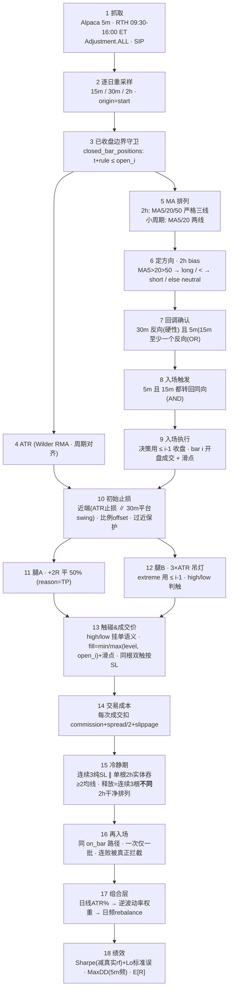

# 二阶段全链路数据流（stage2_full_chain）

> 本文是 `stage2_design_blueprint.md` §14「全链路数据流图」的**逐节展开**。
> 只描述**最新（二阶段目标）设计**——每个环节「干什么 / 确切公式与参数 / 防未来函数时序 / 预测值」，不再并列一阶段旧实现。
> 预测值均为**设计期望量级**（forecast），供修复后向其收敛做证伪。代码定位记为 `文件:行`。

---

## 0. 端到端流程图（比 §14 更细一档）

---

## 1. 单根 5m bar `i` 的决策时序台账（防未来函数的最细粒度证据）

> 全链路只有一条不变量：**站在 bar i 的开盘时刻决策，可见信息止于 i-1 收盘；任何成交价必须是那一刻尚未发生的价。** 下表是这条纪律在每种数据上的落点。

| 数据/动作 | 在 bar `i` 决策时可见的截止点 | 代码锚点（二阶段目标） |
|---|---|---|
| 5m 收盘/MA/回调触发判定 | **≤ i-1**（切片 `df_5m.iloc[:i]`，**不含**当前根） | `pullback_backtest.py:177` 改喂 `:i` |
| 高周期 2h/30m/15m 已收盘 K线 | 满足 `t+rule ≤ open_time(i)` 的最后一根 | `resample.py:71 closed_bar_positions` |
| ATR（初始止损用） | `atr_full.iloc[i-1]` | `pullback_backtest.py:150,183` 对齐到 i-1 |
| 吊灯 `extreme_since_entry` | **≤ i-1** 的极值（不含当根 high/low） | 二阶段重排：先判后更新 |
| **入场成交价** | `open` of bar `i`（决策时刻尚未成交）× (1±滑点) | `pullback_backtest.py:182` 改 `open.iloc[i]` |
| **止损/止盈成交价** | `min/max(level, open_i)` × (1±滑点) | 二阶段 §13 |
| 组合日度权重 | 用 `≤ D-1` 收盘的波动率（`.shift(1)`） | `vol_estimator.py:36,55` |

> 一句话：**决策只读过去，成交只吃「下一口尚未张开的价」。** 上表任一行若把可见截止点往后挪一格（含当根），就是未来函数。

---

## 2. 数据层：抓取与复权（节点 1）

**设计**
- 频率 **5 分钟**，回看 **730 天**（≈2 年）。`fetch_alpaca.py:38-39`
- 复权 `Adjustment.ALL`（拆股+分红），消除公司行为的假跳空。`fetch_alpaca.py:58`
- 盘中过滤 **09:30–16:00 ET**，砍盘前盘后，保证 12 标的 bar 序号可对齐（组合日度权重的前提）。`fetch_alpaca.py:84-86`
- 数据源 **SIP**（全市场 NBBO）；若维持 IEX，则在成本模型里对低流动性标的加一档点差惩罚，补偿 IEX 打印稀疏、价格陈旧。`fetch_alpaca.py:57`

**时序纪律**：抓取是纯历史重组，无未来函数风险。

**预测值**
- 每标的 5m RTH bar：78 根/日 × ~504 交易日 ≈ **3.9 万根**。
- 复权后隔夜 |gap| 中位数 ~0.3–0.6%，尾部（财报/事件）3–8%——因持仓过夜，这条尾巴由次日首根 bar 的 open 成交承接（见节点 13）。

---

## 3. 重采样：5m → 15m / 30m / 2h（节点 2）

**设计**
- 逐交易日 `groupby(et_date)` 重采样，`origin="start"`（每日 09:30 锚定）、`label="left"`、`closed="left"`，区间 `[t, t+rule)`。`resample.py:52`
- 每日锚定的两个理由：(a) bin 不跨越隔夜缺口；(b) 390min/session 不整除 60/120，midnight 锚定会让整点 bin 与真实 09:30 开盘错位。`resample.py:26-36`
- 空 bin（当日最后一根之后 / 缺口）全 NaN，直接丢弃不造假蜡烛。`resample.py:56`
- 引擎用**自带**的 `_HIGHER_TF_RULES = {15m, 30m, 2h}`（`pullback_backtest.py:25`），bias 周期即 **2h**。
- **2h 残缺 bar 处理**：390/120 = 3.25 → 每日第 4 根「2h」只覆盖 15:30–16:00（30min）。设计上对该残缺 bar 单独标记，2h 的 MA 与「实体吞均线」判定按**每日 3 根完整 bar** 口径处理，不让残缺 bar 稀释排列或钝化冷静期触发。
  - *待定选项*：整体切 **1h**（390/60=6.5，仅末根 30min 残缺，影响更小），方向响应快一档——是否切换需 manager 拍板。

**预测值**
- 每日 bar 数：15m ≈ 26、30m ≈ 13、2h ≈ 3.25（含 1 根残缺）。
- 2h MA50 需 50 根 ≈ **15.4 个交易日**预热。

---

## 4. 已收盘边界守卫（节点 3）

**设计**
- 单一实现 `closed_bar_positions`：`close_time = t + rule`，`searchsorted(open_times, side="right") - 1`。`resample.py:90-91`
- 语义：label=left 的 bar 跨 `[t, t+rule)`，**只有 `t+rule ≤ open_time(i)` 才算收盘可用**。用 `<` 会多withhold 一个 5m tick；用 `t ≤ open` 会泄漏仍在形成的 bar。`resample.py:80-85`
- 回测引擎与向量化指标层**共用**这一处边界，杜绝两条路径对「收盘」定义漂移。

**时序纪律**：这是节点 1 台账里「高周期可见截止点」的唯一裁决处。

---

## 5. 指标 A：ATR（节点 4）

**设计**
- True Range = `max(H−L, |H−C_prev|, |L−C_prev|)`；ATR = TR 的 N 期均值。`indicators.py:32-38`
- 平滑用 **Wilder RMA**（α = 1/N；J. Welles Wilder, 1978），对齐业界「1.5~3×ATR」参考区间的同源语义（纯 SMA 对单根极端 TR 反应更硬、与日线经验值不同源）。
- **周期对齐**：止损宽度、吊灯、组合波动率三处复用同一 ATR 公式，但止损/吊灯的 ATR 用**与持仓周期匹配**的周期（**30m 或 2h**，非 5m），否则 `atr_mult×ATR` 退化成 scalp 量级、被固定 offset 支配。
- offset 改为 **0.1×ATR 比例**而非固定 0.3%（见节点 10）。

**预测 ATR%（约 \$100–150 标的）**：5m ≈ 0.08–0.25% ｜ 30m ≈ 0.25–0.6% ｜ 2h ≈ 0.6–1.2% ｜ 日 ≈ 1.5–3%。

---

## 6. 指标 B：MA 排列（节点 5）

**设计**
- **2h 定方向**：MA5/20/50 **严格**三线（`>` 非 `>=`），bullish→long / bearish→short / 其余 neutral。门槛高，第一道闸。`ma_filter.py:22-36`
- **小周期（5m/15m/30m）回调/触发**：只用 MA5/20 两线——三线在小周期几乎不成立（2 年 NVDA 仅 1 次完整走完），两线足以表达「小周期正往哪摆」。`ma_filter.py:39-57`
- 两函数均取 `.iloc[-1]`，数据边界由调用方（节点 4 守卫）控制。

**预测值**
- 2h 严格三线为非 neutral 的时间占比：单标的 ~**35–55%**（趋势高、震荡低）——约一半时间不给方向，是低换手的第一层来源。
- 牛市段方向翻转 ~4–8 次/标的/年。

---

## 7. 级联信号：定方向 → 回调 → 触发（节点 6–8）

**设计（四级时间框架，状态机 `PullbackEntryEngine.on_bar`）**

1. **定方向（节点 6）** `get_trend_bias`：2h bias 非 neutral 才继续。`ma_filter.py:75-76`
2. **回调确认（节点 7）** `pullback_occurred`：30m 转反向排列（**硬性必要**）**且** 5m/15m **至少一个**也反向（OR）。`ma_filter.py:78-84`
   - 30m 硬性 = 保证回调有深度；5m/15m 用 OR 因两者谁先反向不固定（统计 ~27% 的「至少一个反向」时刻只有 15m 反、5m 未反，说明 15m 不是 5m 的影子）。
3. **入场触发（节点 8）** `get_entry_trigger`：5m **且** 15m 都转回与 2h 同向（AND）。`ma_filter.py:86-88`
4. **状态机**：只跨 bar 记 `_bias` 与 `_pullback_seen`；bias 变化（含转 neutral）**作废**累积的回调状态，必须重等一轮新回调。`pullback_entry.py:47-51,61`

- *待定选项*：触发步 additionally 要求 **30m 不再反向**（回到 neutral 或同向），消除「30m 仍反向时入场」窗口，与「多周期共振」叙事更一致——需拍板（会降信号频率）。

**预测值**
- 完整级联触发频率：**45–60 批/标的/年**（冷静期真正生效 + 触发前移后，较污染基线的 66 下降）。
- 回调 → 触发转化率：~**30–50%**（其余因 bias 翻转或迟迟不触发而作废）。

---

## 8. 入场执行：决策与成交时机（节点 9）

**设计**
- 小周期一律喂 `df_5m.iloc[:i]`（**不含**当前 bar），全部决策基于 **≤ i-1** 收盘。`pullback_backtest.py:177`（二阶段改 `:i`）
- 成交价 = `df_5m["open"].iloc[i]`（**当根开盘**，决策时刻尚未发生）× (1 ± 滑点)。`pullback_backtest.py:182`（二阶段改 `iloc[i]`）
- 初始止损 ATR 用 `atr_full.iloc[i-1]`，与成交同步对齐。`pullback_backtest.py:150,183`
- 一次只允许一个 `_OpenBatch`；两腿都出场（或整批止损）前不接新信号。`pullback_backtest.py:170-173`

**时序纪律**：这是节点 1 台账「入场成交价」那一行的落点——**决策读到 i-1，成交吃 bar i 的开盘**，无重叠。

**预测值**
- 入场滑点：liquid 1–2bp、illiquid 3–5bp。
- 前移后单笔平均入场价相对偏移量级 ±0.05–0.15%，对总回报近中性（噪音为主）。

---

## 9. 初始止损：ATR 止损 vs 平台止损，取近端（节点 10）

**设计**
- 候选一 **ATR 止损**：`entry ∓ atr_mult × ATR`（`atr_mult=1.5`，ATR 用 30m/2h 周期）。`stop_loss.py:43-46`
- 候选二 **平台止损**：30m swing high/low（左右各 `swing_k=2` 根的局部极值），取离 entry **最近**的一侧结构位。`stop_loss.py:14-33`
  - 无未来函数：swing 滞后 k 根确认（`range(k, len-k)`，`stop_loss.py:17`），右侧窗口相对 swing bar 是未来、相对决策 bar i 是过去。
- `chosen = min(candidates, key=|entry − lvl|)`——更近/更保守者。`stop_loss.py:50`
- **比例 offset**：向不利方向留 `0.1×ATR`（非固定 0.3%），避免 offset 支配 R。`stop_loss.py:52-53`
- **过近保护**：若最近 swing 距 entry `< 0.5×ATR`，判为噪音、弃用平台候选只留 ATR 候选——否则 R→≈offset，2R 目标落进噪音区、造出假性高胜率。

**预测值（30m ATR 口径）**
- **R（entry→stop）：1.0–1.8%**；2R 目标 ≈ 2.0–3.6%。
- 平台止损被选中（比 ATR 更近）的比例：~35–50%。

---

## 10. 离场腿 A：固定盈亏比部分止盈（节点 11）

**设计**
- 浮盈达 `rr_trigger = 2.0 × R` 时平 `partial_ratio = 50%`，`reason=TP`，锁定确定性利润。`take_profit.py:16-23`；`pullback_backtest.py:136-144`
- 触发价 `partial_trigger_price = entry ± 2R`。`take_profit.py:21-23`

**预测值**
- **腿 A（2R）命中率 = 单笔见到 +2R 的概率 = 策略胜率**。无漂移随机游走、连续监控、2R 止盈 vs 1R 止损下，P(先到 +2R)=**1/3**（optional stopping / 鞅停时基线）。趋势过滤应把它抬到 **34–38%**——这是「有没有 alpha」的核心判据。

---

## 11. 离场腿 B：3×ATR 吊灯止损（节点 12）

**设计**
- 剩余 50% 用吊灯：`trailing_stop = max(extreme_since_entry − 3×ATR, floor_stop)`（多头，只上移；空头对称取 min）。`take_profit.py:25-36`
- `floor_stop` = 原始止损位——剩余仓下行风险**永不劣于初始 R**，不存在「没赚钱先被放飞」。`take_profit.py:8-9`
- ATR 用 `atr_full.iloc[i-1]`（`pullback_backtest.py:150`）。
- **intrabar 纪律**：`extreme_since_entry` 用 **≤ i-1** 的极值算 trail，**先判触碰、后更新极值**——不得用当根 high/low 抬高出场价（否则 `high_i − 3ATR` 靠本根 high 系统性偏乐观）。
- 触碰判定用 bar 的 high/low（节点 13）。

**预测值**
- 命中腿 A 的批次中，~40–55% 的剩余仓能跑出 > 初始 R 的额外利润（趋势延续），其余在 floor_stop 附近保本离场。
- 综合盈亏比（payoff）：**1.8–2.2**。

---

## 12. 触碰检测与成交价：离散→连续偏差修复（节点 13，最高优先级）

**设计**
- **检测（挂单语义）**：多头 `hit_sl = bar_low ≤ stop`、`hit_tp = bar_high ≥ trigger`、`hit_trail = bar_low ≤ trail`；空头对称。`pullback_backtest.py:124-125,155-157`（二阶段由 close 改 high/low）
- **同根双触优先级**：同一 bar 同时触 SL 与 TP，按 **SL** 处理（保守，止损在近端、先被打到概率更高）。
- **成交价（含跳空）**：
  - 止损：多头 `exit = min(stop, bar_open)`、空头 `max(stop, bar_open)`；
  - 止盈/吊灯取不利侧同理；
  - 再叠加滑点（节点 14）。
- **过夜跳空**：因持仓过夜，次日首根 bar 的 open 即跳空成交点，被上式天然覆盖。

**预测值**
- 修复后胜率下移 3–7pt（并入节点 10 的 34–38%）。
- **组合 MaxDD：−4% ~ −8%**（隔夜跳空 + 日内穿越亏损归位）；日收益 std 上升 → Sharpe 分母增大。

---

## 13. 交易成本模型（节点 14）

**设计**
- 每次成交（进/出、每条腿）扣 `commission + spread/2 + slippage`。
- 参数（可分 liquid/illiquid 两档）：佣金 ~0（现代零佣）；点差半幅 liquid 1bp / illiquid 3–5bp；滑点 1–2bp。**单边 2–7bp，往返 4–14bp**。
- 组合层 rebalance 的权重变动另计 turnover 成本，`fee_pct` 归位到此（`portfolio_pullback_backtest.py:214`）。

**预测值**
- 单批往返成本 4–14bp；对 R≈1% 的批次 = 吃掉 **4–14% 的 1R**。
- 全年成本拖累：**portfolio 3–6%/年**（对照毛利量级 ~10%/年，非同小可）。

---

## 14. 冷静期风控 + 再入场（节点 15–16）

**设计**
- **触发一**：同方向**连续 3 次纯 SL**（`reason=="SL"`，从未部分止盈过的批次）；`PROTECTIVE_SL`/`TP` 清零不计（方向没看错，只是回吐）。`cooldown.py:57-68`
- **触发二**：单根 2h K线实体击穿 ≥2 条均线（暴力单边，均线滞后，先观望）。`cooldown.py:70-81`
- **释放**：连续 **3 根「不同的」2h K线**稳定在同一干净排列（非 neutral，允许方向反转）。`cooldown.py:83-99`
  - **计数纪律**：`on_bar` 只在**新 2h bar 收盘**时推进 `_stable_count`（用 2h 时间戳去重），数的是**不同 bar** 而非调用次数——避免每根 5m 调用导致「15 分钟空转释放」。`pullback_backtest.py:107-108` 处按 2h 频率喂入。
- 只挡新开仓，不动已有仓位。
- **再入场**：首仓与再入场**共用** `on_bar` 同一路径；`Signal` 只带 direction/price，执行引擎按 `had_prior_batch` 打 `open`/`reentry` 标签。`pullback_backtest.py:186`；`pullback_entry.py:1-9`

**预测值**
- 冷静期触发 **3–8 次/标的/年**，平均持续 **6–18 小时**（3–9 根 2h bar），期间拦掉 **1–4 个**本会发生的再入场。
- 对全年批次数净影响 −10% ~ −20%（对应节点 7 的 66→45–60）。
- 再入场占总批次 ~55–70%（同一 2h 趋势里反复回调进场是主力来源），冷静期生效后略降。

---

## 15. 组合层：波动率 → 逆波动率权重 → 日频再平衡（节点 17）

**设计**
- **波动率** `rolling_daily_atr_vol`：5m→日线 OHLC，日线 ATR(14) / 日 close（ATR-as-%），`.shift(1)`（D 日只用 ≤ D-1）。`vol_estimator.py:39-55`
- **权重** `InverseVolatilitySizer`：`w_i ∝ 1/vol_i` 归一化（标准 CTA 风险平价；vol≤0 剔除防爆炸），**每日重算**。`sizing.py:7-12`
- **组合日收益** `port_ret = Σ w_s(d) × r_s(d)`，`r_s` 是该标的**策略**日收益；空仓日 `r_s=0` 但仍占权重份额（闲置资金贡献 0，设计如此）。`portfolio_pullback_backtest.py:210-213`
- **贡献度分解** `contrib$[s][dir] += w_s(d) × r_s(d) × equity_before`——净值日度美元变化的精确恒等分解，加总正好等于总利润。`portfolio_pullback_backtest.py:221-230`
- **Benchmark**：**同一套每日权重**套在纯买入持有日收益上，隔离「择时能力」这一个变量（口径统一为「逆波动率加权买入持有」，非等权）。`portfolio_pullback_backtest.py:216-219`

**预测值**
- 单标的日度权重区间 **0.04–0.14**（低波动 GLD 偏高、高波动 INTC/NVDA 偏低）。
- 日度权重 turnover **3–8%/日**（vol 缓变），年化 rebalance 成本可观（节点 13）。

---

## 16. 绩效口径（节点 18）

**设计**
- **Sharpe**：日度 excess return（减**真实日度 rf**，如 3M T-bill）均值/std × √252，并报 Lo(2002) 标准误（日收益含大量 exact-zero 空仓日、高度非正态，√252 的 iid 假设需置信区间约束）。`sharpe.py:22-38`（二阶段传入 rf 序列）
- **闲置资金机会成本**：空仓份额应计 rf 收益，或明确「满仓风险预算 vs 现金」口径。
- **MaxDD**：用 **5m 频**净值（日频会漏日内回撤 + 被跳空抹除，双重低估）。
- **期望值**：`E[R] = WR × payoff − (1−WR)`（R 为单位），须 > 0。
- 补充：Calmar（年化/MaxDD）、单笔 R 分布直方图、per-batch PnL 明细。

**预测值（诚实口径）**
- 单笔期望：WR 36% × payoff 2.0 − 0.64 = **+0.08R**（薄但正）；WR 跌破 **33%@2R 即转负——二阶段生死线**。
- 单标的年化 Sharpe **0.3–0.9**。
- 组合年化 Sharpe = 单票 × √(N/(1+(N−1)ρ))，取单票 0.6、N=12、条件 ρ≈0.2 → **1.0–2.0**。
- 组合年化收益 **5–12%**；MaxDD **−4% ~ −8%**；Calmar ≈ 1–2。

---

## 17. 端到端漏斗（预测值汇总）

| 层级 | 指标 | 预测值 |
|---|---|---|
| 数据 | 5m RTH bar/标的 | ~3.9 万 |
| 方向 | 2h 非 neutral 时间占比 | 35–55% |
| 信号 | 完整级联批次 | 45–60 /标的/年 |
| 信号 | 回调→触发转化 | 30–50% |
| 信号 | 再入场占比 | 55–70% |
| 风控 | 冷静期触发 | 3–8 次/标的/年，拦 1–4 再入场 |
| 单批 | R（entry→stop） | 1.0–1.8% |
| 单批 | 2R 目标 | 2.0–3.6% |
| 单批 | 胜率（2R 命中率） | 34–38% |
| 单批 | payoff | 1.8–2.2 |
| 单批 | 往返成本 | 4–14bp（= 4–14% 的 1R） |
| 单批 | **单笔期望** | **+0.08R**（WR<33% 即负） |
| 组合 | 单标的权重 | 0.04–0.14 |
| 组合 | 日度 turnover | 3–8%/日 |
| 组合 | 成本拖累 | 3–6%/年 |
| 组合 | 单标的 Sharpe | 0.3–0.9 |
| 组合 | **组合 Sharpe** | **1.0–2.0** |
| 组合 | 年化收益 | 5–12% |
| 组合 | MaxDD（5m 频） | −4% ~ −8% |
| 组合 | Calmar | 1–2 |

---

## 18. 悬而未决的设计分叉（需 manager 拍板，不影响本图其余部分）

1. **高周期 bias 框架**：维持 2h（残缺 bar 单独处理）还是切 1h（响应快一档）。
2. **触发是否纳入 30m**：加「30m 不再反向」会降频但更共振一致。
3. **bias 翻转是否平仓**：当前仅靠止损离场，方向暴露与信号框架脱钩——设计选择，至少应单独统计这类持仓 PnL。
4. **跨夜信号时效**：末 N 根 bar 生成的信号是否次日开盘重校验。
5. **持仓过夜 vs 日内平仓**：日内平仓杀掉腿 B 趋势收益来源，是策略性质分叉。

---

*引用来源*
- J. Welles Wilder, *New Concepts in Technical Trading Systems*, Trend Research, 1978（ATR / RMA）。
- Alexander Elder, *Come Into My Trading Room*, Wiley, 2002（Chandelier Stop，原创 Chuck LeBeau）。
- Andrew W. Lo, "The Statistics of Sharpe Ratios", *Financial Analysts Journal*, 58(4), 2002。
- David H. Bailey & Marcos López de Prado, "The Deflated Sharpe Ratio", *Journal of Portfolio Management*, 40(5), 2014。
